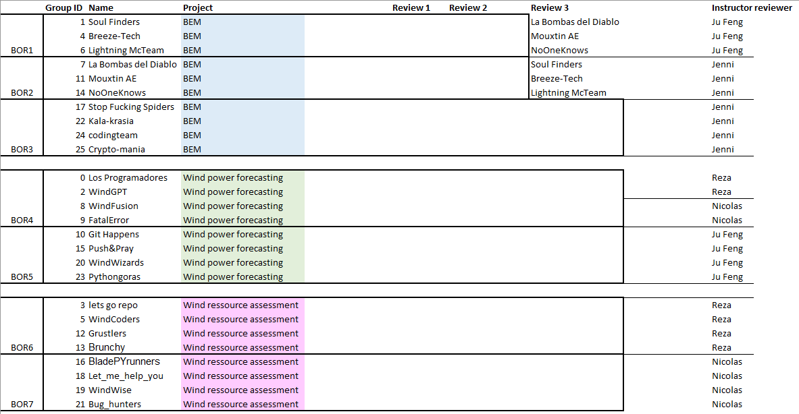

# PiWE Week 13: Final quiz and final project presentations

* **Office hours:** None! The course is done after this week. :')
* **Slides**: to be uploaded.

## Final project requirements and rubric

See PDF in the same folder as this README.
Repos lock **Sunday May 4 at 23:59**.

## Feedback forms due before class

Your team must submit the feedback forms for 3 other teams by **May 7, 23:59**.

In this subfolder, there is an Excel form to help you collate your feedback. The
Excel sheet also contains the functional requirements for the different projects
in the other tabs.

The link to the Microsoft form you need to submit is on Learn / 
Administration.
**When submitting, please remember**:  
 * Be careful when selecting who you are and who you're evaluating.  
 * Check "send me an email receipt of my responses" before submission.
 * Click "Save my response to edit" after submission in case you made a mistake. 

## During class

Here is the planned agenda for Week 13. Team attendance is expected for both the
feedback session and cross-topic presentations.

 * 08.45    Arrive to class, get settled in
 * 09.00    Briefing on quiz
 * 09.05    Quiz begins
 * 09.25    Quiz ends (maybe grab snacks...)
 * 09.40    Feedback session begins. BORs indicated in image below.  
 * 10.20    Session ends, discussion in plenum
 * 10.30    Short break (maybe more snacks?)
 * 10.40    Informal, cross-topic presentations  
    * Some teams will be randomly chosen to stay in BORs, others will rotate.
      Teams will give a short presentation of their package objective
      and then live-demo their main script/notebook.
 * 11.10    Final plenum discussion  
 * 11.20    Wrap-up and thanks
 * 11.30    (optional) Presentation of final course evaluation

## Who you should submit feedback for

The diagram below shows (1) the three teams you submit feedback forms for and (2)
which BOR you should enter in Week 13.

The course evaluation results showed that students did not find it beneficial to
give feedback to teams who did different projects, so we have split according
to project. Teams in BORs with 4 teams (i.e., BORs 3 through 6) should submit
feedback for the other 3 teams in the same room. Teams in BORs 1 and 2 should
review the other 2 teams in their BOR PLUS 1 extra team ("Review 3").

